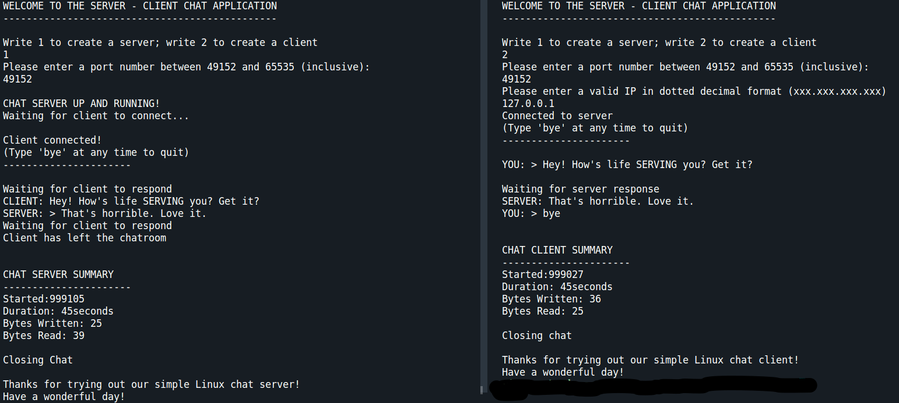

# Simple Linux / C++ Client - Server
## OOP Version

Studying for Network+ exam by programming a simple TCP client and server.

Super simple chat client for Linux that allows for one client to communicate with one server. When the client exits, the server program ends.



## Purpose 

I'm studying for Network+ and wanted some hands-on understanding of TCP in a client-server model.

## Future Plans

Currently, I'm studying sockets and 'the Zombie Problem' a bit more to allow for the server to continue to run and acquire several clients sequentially.

## Install

To install server and client executables using G++ compiler, run:

```
g++ main.cpp object_oriented_version/*/*.h object_oriented_version/*/*.cpp -o chat
```

This executable can create either a server or a client. 

They CAN run on the same device, but you'll need to use `127.0.0.1` as the IP

## Running the program

Once you've compiled the program, run:

```
./chat
```

From there you can decide whether to create a server or client. Remember, the port must match on both and if you've installed them on the same device, make sure to use `127.0.0.1` as the IP.