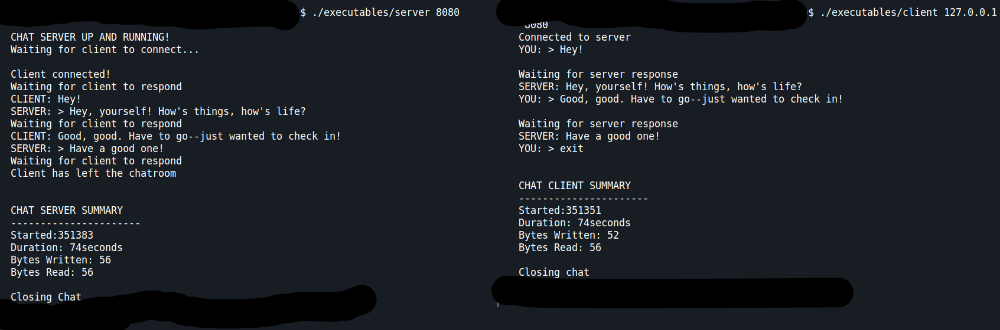

# Simple Linux / C++ Client - Server
## Procedural Version

Studying for Network+ exam by programming a simple TCP client and server.

Super simple chat client for Linux that allows for one client to communicate with one server. When the client exits, the server program ends.



## Purpose 

I'm studying for Network+ and wanted some hands-on understanding of TCP in a client-server model.

## Future Plans

Currently, I'm working on transforming client and server into classes for future installations.

Also, I need to study the Zombie Problem a bit more to allow for the server to continue to run and acquire several clients sequentially.

## Install

To install server and client executables using G++ compiler, run:

```
g++ server.cpp -o server
```

and 

```
g++ client.cpp -o client
```

These two executables are meant to run separately.

They CAN run on the same device, but you'll need to use `127.0.0.1` as the IP

## Running the program

__Server__

Server runs using the command:

```
server <PORT>
```

__Client__

Client runs using the command:

```
client <IP> <PORT>
```

__To run on local: Server__

```
server 8080
```

__To run on local: Client__

(Has to run in another terminal)

```
client 127.0.0.1 8080
```